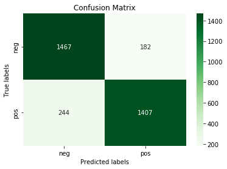

# Amazon review data analysis using SVM  
In this repository we provide sentiment analysis using a supervised machine learning method. In a previous project, we applied the VADER (Valence Aware Dictionary for sEntiment Reasoning), a sentiment intensity analyser implemented in NLTK to analyse our unlabeled amazon reviews data-set, we obtained a performance score of 71%. [Please refer to my article on Vader](https://aouatafdjillani.herokuapp.com/sentiment-analysis-with-vader)
Our main goal is the achieve a better performance in predicting positive and negative reviews. 

## Dataset 
For the vader classifier, we used labeld dataset consisting of 10000 reviews on Amazon products. 
<table border="1" class="dataframe">
  <thead>
    <tr style="text-align: right;">
      <th></th>
      <th>label</th>
      <th>review</th>
    </tr>
  </thead>
  <tbody>
    <tr>
      <th>0</th>
      <td>pos</td>
      <td>Stuning even for the non-gamer: This sound tra...</td>
    </tr>
    <tr>
      <th>1</th>
      <td>pos</td>
      <td>The best soundtrack ever to anything.: I'm rea...</td>
    </tr>
    <tr>
      <th>2</th>
      <td>pos</td>
      <td>Amazing!: This soundtrack is my favorite music...</td>
    </tr>
    <tr>
      <th>3</th>
      <td>pos</td>
      <td>Excellent Soundtrack: I truly like this soundt...</td>
    </tr>
    <tr>
      <th>4</th>
      <td>pos</td>
      <td>Remember, Pull Your Jaw Off The Floor After He...</td>
    </tr>
  </tbody>
</table>
</div>


## Steps 
1. Exploring : our exploratory analysis of our data showed that there is a balance between positive and negative reviews. 
2. Cleaning and prepping : dealing with empty records and splitting data into train and test data-sets
3. Feature Extraction: using the TF-IDF technique (term frequency-inverse document frequency) to measure the relevance of words in the reviews. 
4. Train and test: training and testing the SVM model using Scikit learn 
5.  Visualizing the performance results: using matplotlib and seaborn to show the classification report and the confusion matrix by comparing our classification results with a gold standard (manual labels). 
## Results 
Our model achied a score of 87%. Our models struggle with identifying negative reviews could be due to sarcastic comments. This could be suject to further analysis.   
### Classification Report 


 
```python
#Visualizing Classification Report 
predictions= my_model.predict(X_test)
report = classification_report(y_test,predictions, output_dict=True)

df_report = pd.DataFrame(report).transpose().round(2)

#df_report.style.background_gradient(cmap='greens').set_precision(2)
cm = sns.light_palette("green", as_cmap=True)
df_report.style.background_gradient(cmap=cm)
```


<table id="T_af495039_d6f0_11ec_982f_b978b91ee745" ><thead>    <tr>        <th class="blank level0" ></th>        <th class="col_heading level0 col0" >precision</th>        <th class="col_heading level0 col1" >recall</th>        <th class="col_heading level0 col2" >f1-score</th>        <th class="col_heading level0 col3" >support</th>    </tr></thead><tbody>
                <tr>
                        <th id="T_af495039_d6f0_11ec_982f_b978b91ee745level0_row0" class="row_heading level0 row0" >neg</th>
                        <td id="T_af495039_d6f0_11ec_982f_b978b91ee745row0_col0" class="data row0 col0" >0.86</td>
                        <td id="T_af495039_d6f0_11ec_982f_b978b91ee745row0_col1" class="data row0 col1" >0.89</td>
                        <td id="T_af495039_d6f0_11ec_982f_b978b91ee745row0_col2" class="data row0 col2" >0.87</td>
                        <td id="T_af495039_d6f0_11ec_982f_b978b91ee745row0_col3" class="data row0 col3" >1649</td>
            </tr>
            <tr>
                        <th id="T_af495039_d6f0_11ec_982f_b978b91ee745level0_row1" class="row_heading level0 row1" >pos</th>
                        <td id="T_af495039_d6f0_11ec_982f_b978b91ee745row1_col0" class="data row1 col0" >0.89</td>
                        <td id="T_af495039_d6f0_11ec_982f_b978b91ee745row1_col1" class="data row1 col1" >0.85</td>
                        <td id="T_af495039_d6f0_11ec_982f_b978b91ee745row1_col2" class="data row1 col2" >0.87</td>
                        <td id="T_af495039_d6f0_11ec_982f_b978b91ee745row1_col3" class="data row1 col3" >1651</td>
            </tr>
            <tr>
                        <th id="T_af495039_d6f0_11ec_982f_b978b91ee745level0_row2" class="row_heading level0 row2" >accuracy</th>
                        <td id="T_af495039_d6f0_11ec_982f_b978b91ee745row2_col0" class="data row2 col0" >0.87</td>
                        <td id="T_af495039_d6f0_11ec_982f_b978b91ee745row2_col1" class="data row2 col1" >0.87</td>
                        <td id="T_af495039_d6f0_11ec_982f_b978b91ee745row2_col2" class="data row2 col2" >0.87</td>
                        <td id="T_af495039_d6f0_11ec_982f_b978b91ee745row2_col3" class="data row2 col3" >0.87</td>
            </tr>
            <tr>
                        <th id="T_af495039_d6f0_11ec_982f_b978b91ee745level0_row3" class="row_heading level0 row3" >macro avg</th>
                        <td id="T_af495039_d6f0_11ec_982f_b978b91ee745row3_col0" class="data row3 col0" >0.87</td>
                        <td id="T_af495039_d6f0_11ec_982f_b978b91ee745row3_col1" class="data row3 col1" >0.87</td>
                        <td id="T_af495039_d6f0_11ec_982f_b978b91ee745row3_col2" class="data row3 col2" >0.87</td>
                        <td id="T_af495039_d6f0_11ec_982f_b978b91ee745row3_col3" class="data row3 col3" >3300</td>
            </tr>
            <tr>
                        <th id="T_af495039_d6f0_11ec_982f_b978b91ee745level0_row4" class="row_heading level0 row4" >weighted avg</th>
                        <td id="T_af495039_d6f0_11ec_982f_b978b91ee745row4_col0" class="data row4 col0" >0.87</td>
                        <td id="T_af495039_d6f0_11ec_982f_b978b91ee745row4_col1" class="data row4 col1" >0.87</td>
                        <td id="T_af495039_d6f0_11ec_982f_b978b91ee745row4_col2" class="data row4 col2" >0.87</td>
                        <td id="T_af495039_d6f0_11ec_982f_b978b91ee745row4_col3" class="data row4 col3" >3300</td>
            </tr>
    </tbody></table>

### Confusion Matrix


```python
# Visualizing the confision matrix 
predictions=my_model.predict(X_test)
import matplotlib.pyplot as plt
import seaborn as sns
ax= plt.subplot()
cm=confusion_matrix(y_test,predictions)

sns.heatmap(cm, annot=True, fmt='g', ax=ax,cmap='Greens');  


# labels, title and ticks
ax.set_xlabel('Predicted labels');ax.set_ylabel('True labels');
ax.set_title('Confusion Matrix');
ax.xaxis.set_ticklabels(['neg', 'pos']); ax.yaxis.set_ticklabels(['neg', 'pos']);
```


    

    
    

## Requirements and Setup  

### Virtual Environment Setup 
```bash
python3 -m venv venv
. venv/bin/activate
pip install -r requirements.txt
```
### Requirements Installation 

```bash
pip install -r requirements.txt
```


