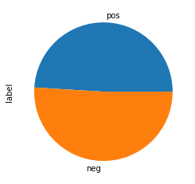
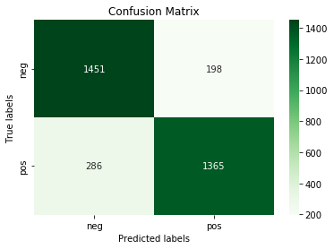

# Amazon product review sentiment analysis using Logistic Regression and Linear SVC 


### Exploring our data-set


```python

import pandas as pd 
import numpy as np 
import matplotlib.pyplot as plt
from sklearn.model_selection import train_test_split
from sklearn.feature_extraction.text import TfidfVectorizer, TfidfTransformer
from sklearn.svm import LinearSVC
from sklearn.pipeline import Pipeline 
from sklearn.metrics import accuracy_score, confusion_matrix, classification_report,ConfusionMatrixDisplay
import seaborn as sns

```


```python
df= pd.read_csv('amazonreviews.tsv', sep='\t', dtype=str)
df.head()

```


<div>
<style scoped>
    .dataframe tbody tr th:only-of-type {
        vertical-align: middle;
    }

    .dataframe tbody tr th {
        vertical-align: top;
    }

    .dataframe thead th {
        text-align: right;
    }
</style>
<table border="1" class="dataframe">
  <thead>
    <tr style="text-align: right;">
      <th></th>
      <th>label</th>
      <th>review</th>
    </tr>
  </thead>
  <tbody>
    <tr>
      <th>0</th>
      <td>pos</td>
      <td>Stuning even for the non-gamer: This sound tra...</td>
    </tr>
    <tr>
      <th>1</th>
      <td>pos</td>
      <td>The best soundtrack ever to anything.: I'm rea...</td>
    </tr>
    <tr>
      <th>2</th>
      <td>pos</td>
      <td>Amazing!: This soundtrack is my favorite music...</td>
    </tr>
    <tr>
      <th>3</th>
      <td>pos</td>
      <td>Excellent Soundtrack: I truly like this soundt...</td>
    </tr>
    <tr>
      <th>4</th>
      <td>pos</td>
      <td>Remember, Pull Your Jaw Off The Floor After He...</td>
    </tr>
  </tbody>
</table>
</div>


```python
# size of dataset
df.shape
```


    (10000, 2)


```python
df['label'].value_counts()

```


    neg    5097
    pos    4903
    Name: label, dtype: int64


```python
# Removing null values
df.isnull().sum()
df.dropna(inplace=True)

```


```python
df['label'].value_counts().sort_values().plot(kind = 'pie')

```


    <matplotlib.axes._subplots.AxesSubplot at 0x7f0fe0d583a0>


    

    


### Cleaning Our data-set


```python
#removing empty strings 
blanks = [] 

for i,lb,rv in df.itertuples():  
    if type(rv)==str:            
        if rv.isspace():         
            blanks.append(i)     
        
df.drop(blanks, inplace=True)
```


```python
#split data-set to train and test
X=df['review']
y=df['label']
X_train, X_test, y_train, y_test = train_test_split(X, y, test_size=0.33, random_state=42)
```

## 1. Logistic Regression 


```python
#Training the model 
from sklearn.linear_model import LogisticRegression
# The pipeline: tf-idf vectorizer and logistic regression model  
lr_model=Pipeline([('tfidf', TfidfVectorizer(lowercase=False)),( 'clf',LogisticRegression(solver='lbfgs'))])

lr_model.fit(X_train,y_train)


```


<style>#sk-container-id-1 {color: black;background-color: white;}#sk-container-id-1 pre{padding: 0;}#sk-container-id-1 div.sk-toggleable {background-color: white;}#sk-container-id-1 label.sk-toggleable__label {cursor: pointer;display: block;width: 100%;margin-bottom: 0;padding: 0.3em;box-sizing: border-box;text-align: center;}#sk-container-id-1 label.sk-toggleable__label-arrow:before {content: "▸";float: left;margin-right: 0.25em;color: #696969;}#sk-container-id-1 label.sk-toggleable__label-arrow:hover:before {color: black;}#sk-container-id-1 div.sk-estimator:hover label.sk-toggleable__label-arrow:before {color: black;}#sk-container-id-1 div.sk-toggleable__content {max-height: 0;max-width: 0;overflow: hidden;text-align: left;background-color: #f0f8ff;}#sk-container-id-1 div.sk-toggleable__content pre {margin: 0.2em;color: black;border-radius: 0.25em;background-color: #f0f8ff;}#sk-container-id-1 input.sk-toggleable__control:checked~div.sk-toggleable__content {max-height: 200px;max-width: 100%;overflow: auto;}#sk-container-id-1 input.sk-toggleable__control:checked~label.sk-toggleable__label-arrow:before {content: "▾";}#sk-container-id-1 div.sk-estimator input.sk-toggleable__control:checked~label.sk-toggleable__label {background-color: #d4ebff;}#sk-container-id-1 div.sk-label input.sk-toggleable__control:checked~label.sk-toggleable__label {background-color: #d4ebff;}#sk-container-id-1 input.sk-hidden--visually {border: 0;clip: rect(1px 1px 1px 1px);clip: rect(1px, 1px, 1px, 1px);height: 1px;margin: -1px;overflow: hidden;padding: 0;position: absolute;width: 1px;}#sk-container-id-1 div.sk-estimator {font-family: monospace;background-color: #f0f8ff;border: 1px dotted black;border-radius: 0.25em;box-sizing: border-box;margin-bottom: 0.5em;}#sk-container-id-1 div.sk-estimator:hover {background-color: #d4ebff;}#sk-container-id-1 div.sk-parallel-item::after {content: "";width: 100%;border-bottom: 1px solid gray;flex-grow: 1;}#sk-container-id-1 div.sk-label:hover label.sk-toggleable__label {background-color: #d4ebff;}#sk-container-id-1 div.sk-serial::before {content: "";position: absolute;border-left: 1px solid gray;box-sizing: border-box;top: 0;bottom: 0;left: 50%;z-index: 0;}#sk-container-id-1 div.sk-serial {display: flex;flex-direction: column;align-items: center;background-color: white;padding-right: 0.2em;padding-left: 0.2em;position: relative;}#sk-container-id-1 div.sk-item {position: relative;z-index: 1;}#sk-container-id-1 div.sk-parallel {display: flex;align-items: stretch;justify-content: center;background-color: white;position: relative;}#sk-container-id-1 div.sk-item::before, #sk-container-id-1 div.sk-parallel-item::before {content: "";position: absolute;border-left: 1px solid gray;box-sizing: border-box;top: 0;bottom: 0;left: 50%;z-index: -1;}#sk-container-id-1 div.sk-parallel-item {display: flex;flex-direction: column;z-index: 1;position: relative;background-color: white;}#sk-container-id-1 div.sk-parallel-item:first-child::after {align-self: flex-end;width: 50%;}#sk-container-id-1 div.sk-parallel-item:last-child::after {align-self: flex-start;width: 50%;}#sk-container-id-1 div.sk-parallel-item:only-child::after {width: 0;}#sk-container-id-1 div.sk-dashed-wrapped {border: 1px dashed gray;margin: 0 0.4em 0.5em 0.4em;box-sizing: border-box;padding-bottom: 0.4em;background-color: white;}#sk-container-id-1 div.sk-label label {font-family: monospace;font-weight: bold;display: inline-block;line-height: 1.2em;}#sk-container-id-1 div.sk-label-container {text-align: center;}#sk-container-id-1 div.sk-container {/* jupyter's `normalize.less` sets `[hidden] { display: none; }` but bootstrap.min.css set `[hidden] { display: none !important; }` so we also need the `!important` here to be able to override the default hidden behavior on the sphinx rendered scikit-learn.org. See: https://github.com/scikit-learn/scikit-learn/issues/21755 */display: inline-block !important;position: relative;}#sk-container-id-1 div.sk-text-repr-fallback {display: none;}</style><div id="sk-container-id-1" class="sk-top-container"><div class="sk-text-repr-fallback"><pre>Pipeline(steps=[(&#x27;tfidf&#x27;, TfidfVectorizer(lowercase=False)),
                (&#x27;clf&#x27;, LogisticRegression())])</pre><b>In a Jupyter environment, please rerun this cell to show the HTML representation or trust the notebook. <br />On GitHub, the HTML representation is unable to render, please try loading this page with nbviewer.org.</b></div><div class="sk-container" hidden><div class="sk-item sk-dashed-wrapped"><div class="sk-label-container"><div class="sk-label sk-toggleable"><input class="sk-toggleable__control sk-hidden--visually" id="sk-estimator-id-1" type="checkbox" ><label for="sk-estimator-id-1" class="sk-toggleable__label sk-toggleable__label-arrow">Pipeline</label><div class="sk-toggleable__content"><pre>Pipeline(steps=[(&#x27;tfidf&#x27;, TfidfVectorizer(lowercase=False)),
                (&#x27;clf&#x27;, LogisticRegression())])</pre></div></div></div><div class="sk-serial"><div class="sk-item"><div class="sk-estimator sk-toggleable"><input class="sk-toggleable__control sk-hidden--visually" id="sk-estimator-id-2" type="checkbox" ><label for="sk-estimator-id-2" class="sk-toggleable__label sk-toggleable__label-arrow">TfidfVectorizer</label><div class="sk-toggleable__content"><pre>TfidfVectorizer(lowercase=False)</pre></div></div></div><div class="sk-item"><div class="sk-estimator sk-toggleable"><input class="sk-toggleable__control sk-hidden--visually" id="sk-estimator-id-3" type="checkbox" ><label for="sk-estimator-id-3" class="sk-toggleable__label sk-toggleable__label-arrow">LogisticRegression</label><div class="sk-toggleable__content"><pre>LogisticRegression()</pre></div></div></div></div></div></div></div>


```python
#Visualizing Classification Report 
predictions= lr_model.predict(X_test)
report = classification_report(y_test,predictions, output_dict=True)

df_report = pd.DataFrame(report).transpose().round(2)

#df_report.style.background_gradient(cmap='greens').set_precision(2)
cm = sns.light_palette("green", as_cmap=True)
df_report.style.background_gradient(cmap=cm)
```


<style  type="text/css" >
    #T_af495038_d6f0_11ec_982f_b978b91ee745row0_col0 {
            background-color:  #ebf3eb;
            color:  #000000;
        }    #T_af495038_d6f0_11ec_982f_b978b91ee745row0_col1 {
            background-color:  #008000;
            color:  #f1f1f1;
        }    #T_af495038_d6f0_11ec_982f_b978b91ee745row0_col2 {
            background-color:  #008000;
            color:  #f1f1f1;
        }    #T_af495038_d6f0_11ec_982f_b978b91ee745row0_col3 {
            background-color:  #76ba76;
            color:  #000000;
        }    #T_af495038_d6f0_11ec_982f_b978b91ee745row1_col0 {
            background-color:  #008000;
            color:  #f1f1f1;
        }    #T_af495038_d6f0_11ec_982f_b978b91ee745row1_col1 {
            background-color:  #ebf3eb;
            color:  #000000;
        }    #T_af495038_d6f0_11ec_982f_b978b91ee745row1_col2 {
            background-color:  #ebf3eb;
            color:  #000000;
        }    #T_af495038_d6f0_11ec_982f_b978b91ee745row1_col3 {
            background-color:  #75b975;
            color:  #000000;
        }    #T_af495038_d6f0_11ec_982f_b978b91ee745row2_col0 {
            background-color:  #9ccd9c;
            color:  #000000;
        }    #T_af495038_d6f0_11ec_982f_b978b91ee745row2_col1 {
            background-color:  #8dc58d;
            color:  #000000;
        }    #T_af495038_d6f0_11ec_982f_b978b91ee745row2_col2 {
            background-color:  #ebf3eb;
            color:  #000000;
        }    #T_af495038_d6f0_11ec_982f_b978b91ee745row2_col3 {
            background-color:  #ebf3eb;
            color:  #000000;
        }    #T_af495038_d6f0_11ec_982f_b978b91ee745row3_col0 {
            background-color:  #9ccd9c;
            color:  #000000;
        }    #T_af495038_d6f0_11ec_982f_b978b91ee745row3_col1 {
            background-color:  #8dc58d;
            color:  #000000;
        }    #T_af495038_d6f0_11ec_982f_b978b91ee745row3_col2 {
            background-color:  #ebf3eb;
            color:  #000000;
        }    #T_af495038_d6f0_11ec_982f_b978b91ee745row3_col3 {
            background-color:  #008000;
            color:  #f1f1f1;
        }    #T_af495038_d6f0_11ec_982f_b978b91ee745row4_col0 {
            background-color:  #9ccd9c;
            color:  #000000;
        }    #T_af495038_d6f0_11ec_982f_b978b91ee745row4_col1 {
            background-color:  #8dc58d;
            color:  #000000;
        }    #T_af495038_d6f0_11ec_982f_b978b91ee745row4_col2 {
            background-color:  #ebf3eb;
            color:  #000000;
        }    #T_af495038_d6f0_11ec_982f_b978b91ee745row4_col3 {
            background-color:  #008000;
            color:  #f1f1f1;
        }</style><table id="T_af495038_d6f0_11ec_982f_b978b91ee745" ><thead>    <tr>        <th class="blank level0" ></th>        <th class="col_heading level0 col0" >precision</th>        <th class="col_heading level0 col1" >recall</th>        <th class="col_heading level0 col2" >f1-score</th>        <th class="col_heading level0 col3" >support</th>    </tr></thead><tbody>
                <tr>
                        <th id="T_af495038_d6f0_11ec_982f_b978b91ee745level0_row0" class="row_heading level0 row0" >neg</th>
                        <td id="T_af495038_d6f0_11ec_982f_b978b91ee745row0_col0" class="data row0 col0" >0.84</td>
                        <td id="T_af495038_d6f0_11ec_982f_b978b91ee745row0_col1" class="data row0 col1" >0.88</td>
                        <td id="T_af495038_d6f0_11ec_982f_b978b91ee745row0_col2" class="data row0 col2" >0.86</td>
                        <td id="T_af495038_d6f0_11ec_982f_b978b91ee745row0_col3" class="data row0 col3" >1649</td>
            </tr>
            <tr>
                        <th id="T_af495038_d6f0_11ec_982f_b978b91ee745level0_row1" class="row_heading level0 row1" >pos</th>
                        <td id="T_af495038_d6f0_11ec_982f_b978b91ee745row1_col0" class="data row1 col0" >0.87</td>
                        <td id="T_af495038_d6f0_11ec_982f_b978b91ee745row1_col1" class="data row1 col1" >0.83</td>
                        <td id="T_af495038_d6f0_11ec_982f_b978b91ee745row1_col2" class="data row1 col2" >0.85</td>
                        <td id="T_af495038_d6f0_11ec_982f_b978b91ee745row1_col3" class="data row1 col3" >1651</td>
            </tr>
            <tr>
                        <th id="T_af495038_d6f0_11ec_982f_b978b91ee745level0_row2" class="row_heading level0 row2" >accuracy</th>
                        <td id="T_af495038_d6f0_11ec_982f_b978b91ee745row2_col0" class="data row2 col0" >0.85</td>
                        <td id="T_af495038_d6f0_11ec_982f_b978b91ee745row2_col1" class="data row2 col1" >0.85</td>
                        <td id="T_af495038_d6f0_11ec_982f_b978b91ee745row2_col2" class="data row2 col2" >0.85</td>
                        <td id="T_af495038_d6f0_11ec_982f_b978b91ee745row2_col3" class="data row2 col3" >0.85</td>
            </tr>
            <tr>
                        <th id="T_af495038_d6f0_11ec_982f_b978b91ee745level0_row3" class="row_heading level0 row3" >macro avg</th>
                        <td id="T_af495038_d6f0_11ec_982f_b978b91ee745row3_col0" class="data row3 col0" >0.85</td>
                        <td id="T_af495038_d6f0_11ec_982f_b978b91ee745row3_col1" class="data row3 col1" >0.85</td>
                        <td id="T_af495038_d6f0_11ec_982f_b978b91ee745row3_col2" class="data row3 col2" >0.85</td>
                        <td id="T_af495038_d6f0_11ec_982f_b978b91ee745row3_col3" class="data row3 col3" >3300</td>
            </tr>
            <tr>
                        <th id="T_af495038_d6f0_11ec_982f_b978b91ee745level0_row4" class="row_heading level0 row4" >weighted avg</th>
                        <td id="T_af495038_d6f0_11ec_982f_b978b91ee745row4_col0" class="data row4 col0" >0.85</td>
                        <td id="T_af495038_d6f0_11ec_982f_b978b91ee745row4_col1" class="data row4 col1" >0.85</td>
                        <td id="T_af495038_d6f0_11ec_982f_b978b91ee745row4_col2" class="data row4 col2" >0.85</td>
                        <td id="T_af495038_d6f0_11ec_982f_b978b91ee745row4_col3" class="data row4 col3" >3300</td>
            </tr>
    </tbody></table>


```python
# Visualizing Confusion Matrix 
import matplotlib.pyplot as plt
ax= plt.subplot()
cm=confusion_matrix(y_test,predictions)

sns.heatmap(cm, annot=True, fmt='g', ax=ax,cmap='Greens');  


# labels, title and ticks
ax.set_xlabel('Predicted labels');ax.set_ylabel('True labels');
ax.set_title('Confusion Matrix');
ax.xaxis.set_ticklabels(['neg', 'pos']); ax.yaxis.set_ticklabels(['neg', 'pos']);
```


    

    


## 2. SVM : Linear SVC 


```python
#pipeline(choose vectorizer, choose model)
my_model=Pipeline([('tfidf', TfidfVectorizer()),('classifier',LinearSVC())])
#the training 
my_model.fit(X_train,y_train)
```


<style>#sk-container-id-2 {color: black;background-color: white;}#sk-container-id-2 pre{padding: 0;}#sk-container-id-2 div.sk-toggleable {background-color: white;}#sk-container-id-2 label.sk-toggleable__label {cursor: pointer;display: block;width: 100%;margin-bottom: 0;padding: 0.3em;box-sizing: border-box;text-align: center;}#sk-container-id-2 label.sk-toggleable__label-arrow:before {content: "▸";float: left;margin-right: 0.25em;color: #696969;}#sk-container-id-2 label.sk-toggleable__label-arrow:hover:before {color: black;}#sk-container-id-2 div.sk-estimator:hover label.sk-toggleable__label-arrow:before {color: black;}#sk-container-id-2 div.sk-toggleable__content {max-height: 0;max-width: 0;overflow: hidden;text-align: left;background-color: #f0f8ff;}#sk-container-id-2 div.sk-toggleable__content pre {margin: 0.2em;color: black;border-radius: 0.25em;background-color: #f0f8ff;}#sk-container-id-2 input.sk-toggleable__control:checked~div.sk-toggleable__content {max-height: 200px;max-width: 100%;overflow: auto;}#sk-container-id-2 input.sk-toggleable__control:checked~label.sk-toggleable__label-arrow:before {content: "▾";}#sk-container-id-2 div.sk-estimator input.sk-toggleable__control:checked~label.sk-toggleable__label {background-color: #d4ebff;}#sk-container-id-2 div.sk-label input.sk-toggleable__control:checked~label.sk-toggleable__label {background-color: #d4ebff;}#sk-container-id-2 input.sk-hidden--visually {border: 0;clip: rect(1px 1px 1px 1px);clip: rect(1px, 1px, 1px, 1px);height: 1px;margin: -1px;overflow: hidden;padding: 0;position: absolute;width: 1px;}#sk-container-id-2 div.sk-estimator {font-family: monospace;background-color: #f0f8ff;border: 1px dotted black;border-radius: 0.25em;box-sizing: border-box;margin-bottom: 0.5em;}#sk-container-id-2 div.sk-estimator:hover {background-color: #d4ebff;}#sk-container-id-2 div.sk-parallel-item::after {content: "";width: 100%;border-bottom: 1px solid gray;flex-grow: 1;}#sk-container-id-2 div.sk-label:hover label.sk-toggleable__label {background-color: #d4ebff;}#sk-container-id-2 div.sk-serial::before {content: "";position: absolute;border-left: 1px solid gray;box-sizing: border-box;top: 0;bottom: 0;left: 50%;z-index: 0;}#sk-container-id-2 div.sk-serial {display: flex;flex-direction: column;align-items: center;background-color: white;padding-right: 0.2em;padding-left: 0.2em;position: relative;}#sk-container-id-2 div.sk-item {position: relative;z-index: 1;}#sk-container-id-2 div.sk-parallel {display: flex;align-items: stretch;justify-content: center;background-color: white;position: relative;}#sk-container-id-2 div.sk-item::before, #sk-container-id-2 div.sk-parallel-item::before {content: "";position: absolute;border-left: 1px solid gray;box-sizing: border-box;top: 0;bottom: 0;left: 50%;z-index: -1;}#sk-container-id-2 div.sk-parallel-item {display: flex;flex-direction: column;z-index: 1;position: relative;background-color: white;}#sk-container-id-2 div.sk-parallel-item:first-child::after {align-self: flex-end;width: 50%;}#sk-container-id-2 div.sk-parallel-item:last-child::after {align-self: flex-start;width: 50%;}#sk-container-id-2 div.sk-parallel-item:only-child::after {width: 0;}#sk-container-id-2 div.sk-dashed-wrapped {border: 1px dashed gray;margin: 0 0.4em 0.5em 0.4em;box-sizing: border-box;padding-bottom: 0.4em;background-color: white;}#sk-container-id-2 div.sk-label label {font-family: monospace;font-weight: bold;display: inline-block;line-height: 1.2em;}#sk-container-id-2 div.sk-label-container {text-align: center;}#sk-container-id-2 div.sk-container {/* jupyter's `normalize.less` sets `[hidden] { display: none; }` but bootstrap.min.css set `[hidden] { display: none !important; }` so we also need the `!important` here to be able to override the default hidden behavior on the sphinx rendered scikit-learn.org. See: https://github.com/scikit-learn/scikit-learn/issues/21755 */display: inline-block !important;position: relative;}#sk-container-id-2 div.sk-text-repr-fallback {display: none;}</style><div id="sk-container-id-2" class="sk-top-container"><div class="sk-text-repr-fallback"><pre>Pipeline(steps=[(&#x27;tfidf&#x27;, TfidfVectorizer()), (&#x27;classifier&#x27;, LinearSVC())])</pre><b>In a Jupyter environment, please rerun this cell to show the HTML representation or trust the notebook. <br />On GitHub, the HTML representation is unable to render, please try loading this page with nbviewer.org.</b></div><div class="sk-container" hidden><div class="sk-item sk-dashed-wrapped"><div class="sk-label-container"><div class="sk-label sk-toggleable"><input class="sk-toggleable__control sk-hidden--visually" id="sk-estimator-id-4" type="checkbox" ><label for="sk-estimator-id-4" class="sk-toggleable__label sk-toggleable__label-arrow">Pipeline</label><div class="sk-toggleable__content"><pre>Pipeline(steps=[(&#x27;tfidf&#x27;, TfidfVectorizer()), (&#x27;classifier&#x27;, LinearSVC())])</pre></div></div></div><div class="sk-serial"><div class="sk-item"><div class="sk-estimator sk-toggleable"><input class="sk-toggleable__control sk-hidden--visually" id="sk-estimator-id-5" type="checkbox" ><label for="sk-estimator-id-5" class="sk-toggleable__label sk-toggleable__label-arrow">TfidfVectorizer</label><div class="sk-toggleable__content"><pre>TfidfVectorizer()</pre></div></div></div><div class="sk-item"><div class="sk-estimator sk-toggleable"><input class="sk-toggleable__control sk-hidden--visually" id="sk-estimator-id-6" type="checkbox" ><label for="sk-estimator-id-6" class="sk-toggleable__label sk-toggleable__label-arrow">LinearSVC</label><div class="sk-toggleable__content"><pre>LinearSVC()</pre></div></div></div></div></div></div></div>


```python
#Visualizing Classification Report 
predictions= my_model.predict(X_test)
report = classification_report(y_test,predictions, output_dict=True)

df_report = pd.DataFrame(report).transpose().round(2)

#df_report.style.background_gradient(cmap='greens').set_precision(2)
cm = sns.light_palette("green", as_cmap=True)
df_report.style.background_gradient(cmap=cm)
```


<style  type="text/css" >
    #T_af495039_d6f0_11ec_982f_b978b91ee745row0_col0 {
            background-color:  #ebf3eb;
            color:  #000000;
        }    #T_af495039_d6f0_11ec_982f_b978b91ee745row0_col1 {
            background-color:  #008000;
            color:  #f1f1f1;
        }    #T_af495039_d6f0_11ec_982f_b978b91ee745row0_col2 {
            background-color:  #ebf3eb;
            color:  #000000;
        }    #T_af495039_d6f0_11ec_982f_b978b91ee745row0_col3 {
            background-color:  #76ba76;
            color:  #000000;
        }    #T_af495039_d6f0_11ec_982f_b978b91ee745row1_col0 {
            background-color:  #008000;
            color:  #f1f1f1;
        }    #T_af495039_d6f0_11ec_982f_b978b91ee745row1_col1 {
            background-color:  #ebf3eb;
            color:  #000000;
        }    #T_af495039_d6f0_11ec_982f_b978b91ee745row1_col2 {
            background-color:  #ebf3eb;
            color:  #000000;
        }    #T_af495039_d6f0_11ec_982f_b978b91ee745row1_col3 {
            background-color:  #75b975;
            color:  #000000;
        }    #T_af495039_d6f0_11ec_982f_b978b91ee745row2_col0 {
            background-color:  #9ccd9c;
            color:  #000000;
        }    #T_af495039_d6f0_11ec_982f_b978b91ee745row2_col1 {
            background-color:  #75b975;
            color:  #000000;
        }    #T_af495039_d6f0_11ec_982f_b978b91ee745row2_col2 {
            background-color:  #ebf3eb;
            color:  #000000;
        }    #T_af495039_d6f0_11ec_982f_b978b91ee745row2_col3 {
            background-color:  #ebf3eb;
            color:  #000000;
        }    #T_af495039_d6f0_11ec_982f_b978b91ee745row3_col0 {
            background-color:  #9ccd9c;
            color:  #000000;
        }    #T_af495039_d6f0_11ec_982f_b978b91ee745row3_col1 {
            background-color:  #75b975;
            color:  #000000;
        }    #T_af495039_d6f0_11ec_982f_b978b91ee745row3_col2 {
            background-color:  #ebf3eb;
            color:  #000000;
        }    #T_af495039_d6f0_11ec_982f_b978b91ee745row3_col3 {
            background-color:  #008000;
            color:  #f1f1f1;
        }    #T_af495039_d6f0_11ec_982f_b978b91ee745row4_col0 {
            background-color:  #9ccd9c;
            color:  #000000;
        }    #T_af495039_d6f0_11ec_982f_b978b91ee745row4_col1 {
            background-color:  #75b975;
            color:  #000000;
        }    #T_af495039_d6f0_11ec_982f_b978b91ee745row4_col2 {
            background-color:  #ebf3eb;
            color:  #000000;
        }    #T_af495039_d6f0_11ec_982f_b978b91ee745row4_col3 {
            background-color:  #008000;
            color:  #f1f1f1;
        }</style><table id="T_af495039_d6f0_11ec_982f_b978b91ee745" ><thead>    <tr>        <th class="blank level0" ></th>        <th class="col_heading level0 col0" >precision</th>        <th class="col_heading level0 col1" >recall</th>        <th class="col_heading level0 col2" >f1-score</th>        <th class="col_heading level0 col3" >support</th>    </tr></thead><tbody>
                <tr>
                        <th id="T_af495039_d6f0_11ec_982f_b978b91ee745level0_row0" class="row_heading level0 row0" >neg</th>
                        <td id="T_af495039_d6f0_11ec_982f_b978b91ee745row0_col0" class="data row0 col0" >0.86</td>
                        <td id="T_af495039_d6f0_11ec_982f_b978b91ee745row0_col1" class="data row0 col1" >0.89</td>
                        <td id="T_af495039_d6f0_11ec_982f_b978b91ee745row0_col2" class="data row0 col2" >0.87</td>
                        <td id="T_af495039_d6f0_11ec_982f_b978b91ee745row0_col3" class="data row0 col3" >1649</td>
            </tr>
            <tr>
                        <th id="T_af495039_d6f0_11ec_982f_b978b91ee745level0_row1" class="row_heading level0 row1" >pos</th>
                        <td id="T_af495039_d6f0_11ec_982f_b978b91ee745row1_col0" class="data row1 col0" >0.89</td>
                        <td id="T_af495039_d6f0_11ec_982f_b978b91ee745row1_col1" class="data row1 col1" >0.85</td>
                        <td id="T_af495039_d6f0_11ec_982f_b978b91ee745row1_col2" class="data row1 col2" >0.87</td>
                        <td id="T_af495039_d6f0_11ec_982f_b978b91ee745row1_col3" class="data row1 col3" >1651</td>
            </tr>
            <tr>
                        <th id="T_af495039_d6f0_11ec_982f_b978b91ee745level0_row2" class="row_heading level0 row2" >accuracy</th>
                        <td id="T_af495039_d6f0_11ec_982f_b978b91ee745row2_col0" class="data row2 col0" >0.87</td>
                        <td id="T_af495039_d6f0_11ec_982f_b978b91ee745row2_col1" class="data row2 col1" >0.87</td>
                        <td id="T_af495039_d6f0_11ec_982f_b978b91ee745row2_col2" class="data row2 col2" >0.87</td>
                        <td id="T_af495039_d6f0_11ec_982f_b978b91ee745row2_col3" class="data row2 col3" >0.87</td>
            </tr>
            <tr>
                        <th id="T_af495039_d6f0_11ec_982f_b978b91ee745level0_row3" class="row_heading level0 row3" >macro avg</th>
                        <td id="T_af495039_d6f0_11ec_982f_b978b91ee745row3_col0" class="data row3 col0" >0.87</td>
                        <td id="T_af495039_d6f0_11ec_982f_b978b91ee745row3_col1" class="data row3 col1" >0.87</td>
                        <td id="T_af495039_d6f0_11ec_982f_b978b91ee745row3_col2" class="data row3 col2" >0.87</td>
                        <td id="T_af495039_d6f0_11ec_982f_b978b91ee745row3_col3" class="data row3 col3" >3300</td>
            </tr>
            <tr>
                        <th id="T_af495039_d6f0_11ec_982f_b978b91ee745level0_row4" class="row_heading level0 row4" >weighted avg</th>
                        <td id="T_af495039_d6f0_11ec_982f_b978b91ee745row4_col0" class="data row4 col0" >0.87</td>
                        <td id="T_af495039_d6f0_11ec_982f_b978b91ee745row4_col1" class="data row4 col1" >0.87</td>
                        <td id="T_af495039_d6f0_11ec_982f_b978b91ee745row4_col2" class="data row4 col2" >0.87</td>
                        <td id="T_af495039_d6f0_11ec_982f_b978b91ee745row4_col3" class="data row4 col3" >3300</td>
            </tr>
    </tbody></table>


```python
# Visualizing the confision matrix 
predictions=my_model.predict(X_test)
import matplotlib.pyplot as plt
import seaborn as sns
ax= plt.subplot()
cm=confusion_matrix(y_test,predictions)

sns.heatmap(cm, annot=True, fmt='g', ax=ax,cmap='Greens');  


# labels, title and ticks
ax.set_xlabel('Predicted labels');ax.set_ylabel('True labels');
ax.set_title('Confusion Matrix');
ax.xaxis.set_ticklabels(['neg', 'pos']); ax.yaxis.set_ticklabels(['neg', 'pos']);
```


    

    

